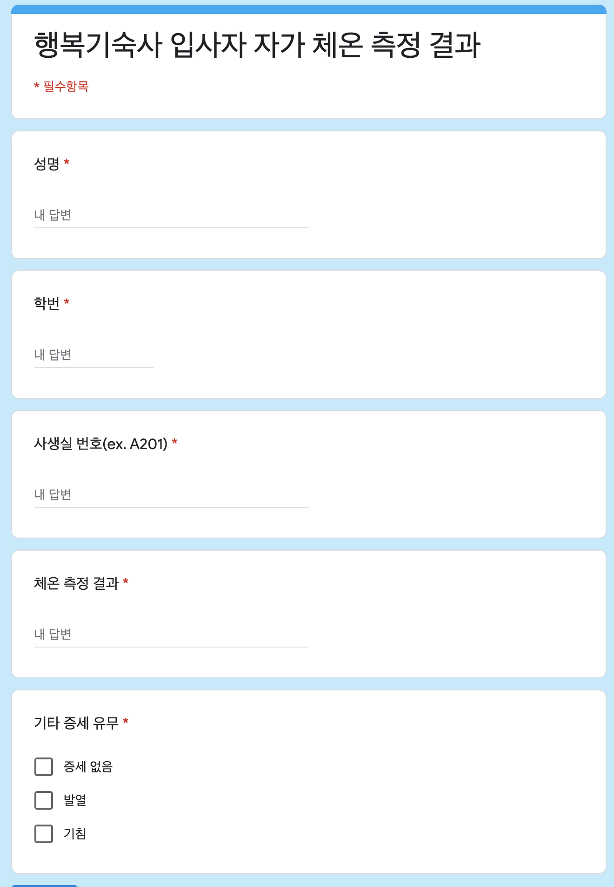
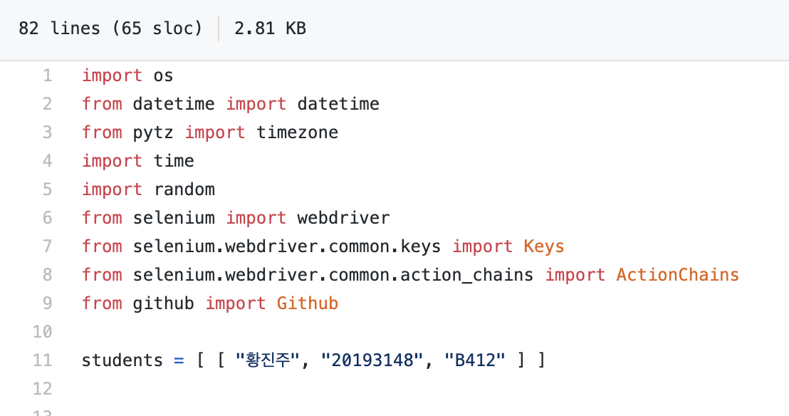

# 행복기숙사 자동 발열 설문지 자동화
자동으로 발열 체크를 하고 깃헙 액션을 통해서 자동화를 진행합니다.



------

## 자기 자신 추가 하는 방법
1. <a href="#1">Pull Request</a>
2. <a href="#2">Issue 등록</a>
3. <a href="#3">Fork</a>
4. <a href="#4">Github에서 클론</a>
---
## <div id="1">PR (Pull Request)</div>
  1. 11번 째 라인에 있는 students 변수에 [이름, 학번, 방번호] 입력 후 추가
  2. PR 요청
  3. 확인 후 Merge 작업
  4. 아래의 이미지 참조.
  
  
------
## <div id="2">Issue 등록</a>
  1. [이슈](https://github.com/Piorosen/github-Action-HangKik/issues) 등록 하기 위해서 링크를 들어간다.
  2. [새롭게 등록](https://github.com/Piorosen/github-Action-HangKik/issues/new)하기 위해서 옆에 있는 New Issue를 클릭한다.
  3. Issue 템플릿 중 [데이터 추가 요청] 이런 템플릿 선택
  4. 이슈 등록 한 뒤, 잠시 후 Piorosen이 확인 후 추가. 

------

## <div id="3">Fork를 이용한 추가</div>
  1. Fork 한 후 본인 레포 확인
  2. 66번 째 라인에 있는 모든 학생 정보 삭제
  3. 자기 학번을 [ [이름, 학번, 방번호] ] 순으로 작성
  4. Github Issue에는 자동적으로 관련된 정보는 나오지 않음
    * 이 부분은 숙지 해야함.
---
## <div id="4">Clone을 이용한 자동화 프로그램 실행 (우분투 18.04)</div>
  1. 가능하다면 Github의 Secrets의 정보도 포함 해야 합니다.
  2. 진행 했다면 아래의 코드를 호출 합니다.
```
# git clone https://github.com/Piorosen/github-Action-HangKik
# cd github-Action-HangKik
# apt install python3-dev
# pip3 install selenium requests twython pillow PyGithub pytz
# sudo apt-get install fonts-unfonts-core
# sudo apt-get install fonts-unfonts-extra
# wget -q -O - https://dl-ssl.google.com/linux/linux_signing_key.pub | sudo apt-key add        
# sudo apt-get install google-chrome-stable    
# wget https://chromedriver.storage.googleapis.com/2.40/chromedriver_linux64.zip
# unzip ./chromedriver_linux64.zip
# python main.py
```
  *. [자동화 코드](https://github.com/Piorosen/github-Action-HangKik/blob/main/.github/workflows/auto.yml)에 코드가 자세히 나와있습니다.
  
  
Contirubte :
  1. [황진주](https://github.com/oMFDOo) (셀레니움을 활용한 자동화 코드 작성)
  2. [차주형](https://github.com/Piorosen) (Github Action을 이용하여 자동적으로 프로그램 구동)
